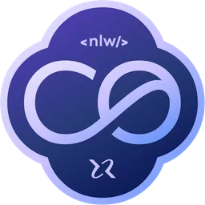

### 🌐 PT-BR
#### [EN-US](https://github.com/ArthurFakhouri/NLW-Journey-Server-Node/blob/master/READMEENUS.md)

    

    

  <a href="#-projeto">Projeto</a>&nbsp;&nbsp;&nbsp;|&nbsp;&nbsp;&nbsp;
  <a href="#requisitos">Requisitos</a>&nbsp;&nbsp;&nbsp;|&nbsp;&nbsp;&nbsp;
  <a href="#executar-em-modo-de-desenvolvimento">Executar em modo de desenvolvimento</a>&nbsp;&nbsp;&nbsp;|&nbsp;&nbsp;&nbsp;
  <a href="#executar-migrations">Executar migrations</a>&nbsp;&nbsp;&nbsp;|&nbsp;&nbsp;&nbsp;
  <a href="#executar-em-modo-de-produção">Executar em modo de produção</a>&nbsp;&nbsp;&nbsp;|&nbsp;&nbsp;&nbsp;
  <a href="#executar-o-drizzle-studio">Executar o Drizzle Studio</a>&nbsp;&nbsp;&nbsp;|&nbsp;&nbsp;&nbsp;
  <a href="#-tecnologias">Tecnologias</a>&nbsp;&nbsp;&nbsp;|&nbsp;&nbsp;&nbsp;
  <a href="#memo-licença">Licença</a>

## 🈸 Projeto

O projeto é um site responsivo de inscrição e indicação para eventos, Esse é um projeto do evento NLW Connect, um dos conteúdos disponíveis para alunos da Rocketseat.

## Requisitos

- [ ✔ ] A aplicação deve poder inscrever em um evento;
- [ ✔ ] A aplicação deve poder visualizar acessos ao link por id do inscrito;
- [ ✔ ] A aplicação deve poder visualizar inscrições feitas através do link de indicação por id do inscrito;
- [ ✔ ] A aplicação deve poder visualizar posição do ranking do inscrito;
- [ ✔ ] A aplicação deve poder visualizar o ranking;

## 🔧 Comandos de execução

### Executar em modo de desenvolvimento
npm run dev

### Executar migrations
npm run db:migrate

### Executar em modo de produção
01 - npm run build
02 - npm run start

### Executar o Drizzle Studio
npm run db:studio

## 🚀 Tecnologias

O projeto foi desenvolvido utilizando as seguintes tecnologias:

- [Node](https://nodejs.org)
- [Fastify](https://fastify.dev)
- [Zod](https://zod.dev)
- [Drizzle](https://orm.drizzle.team)
- [Docker](https://www.docker.com)
- [Postgres](https://www.postgresql.org)
- [Redis](https://redis.io)
- [Typescript](https://www.typescriptlang.org)

## :memo: Licença
Este projeto está sob a licença do MIT. Consulte a [LICENÇA](LICENSE) para obter detalhes.
